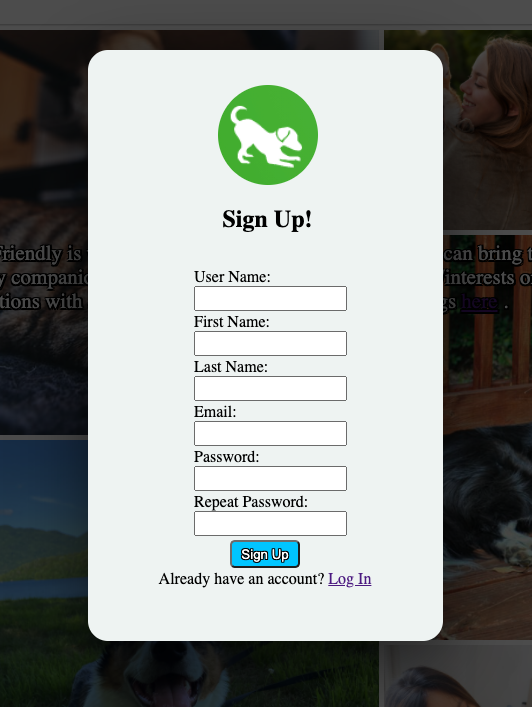
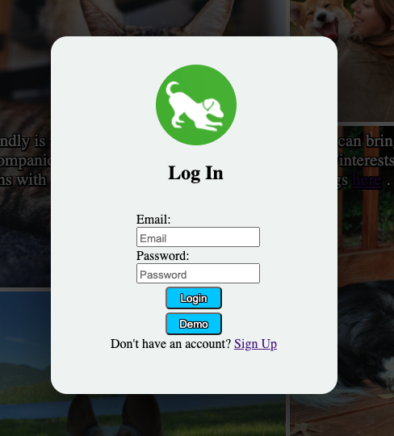
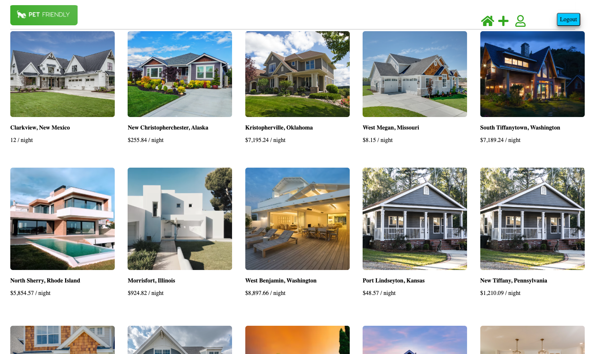
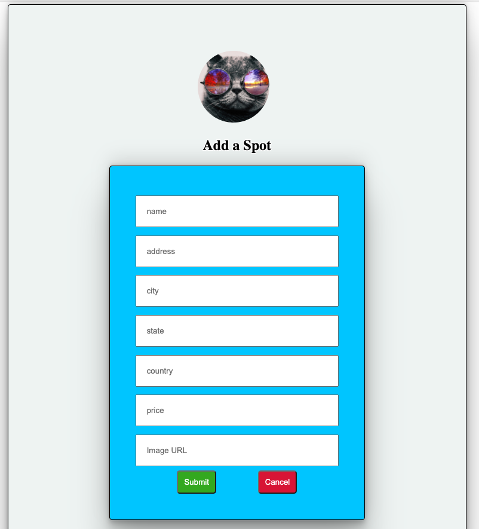
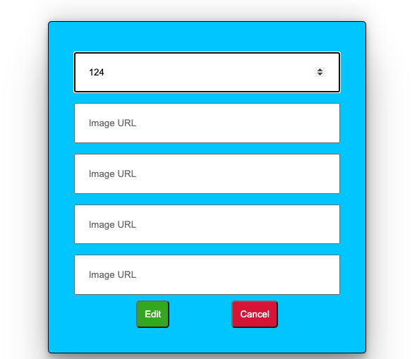
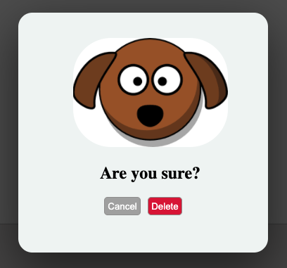
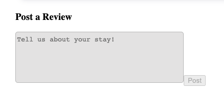
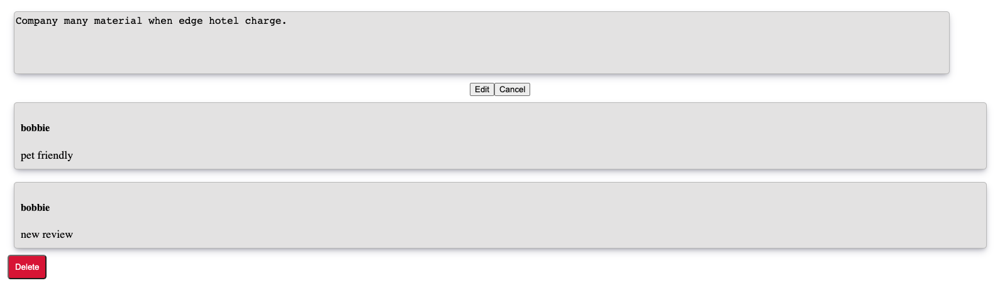
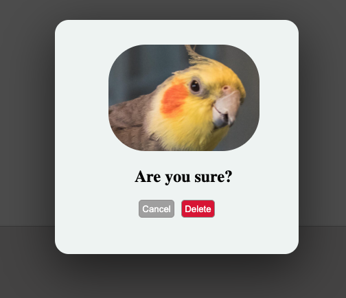

# PetFriendly
PetFriendly is way for users to find locations where they can bring their furry companions.
Users can sign up and express thoughts/interests on locations by leaving a review.
The PetFriendly live link can be found here: <a href='https://petfriendlyy.herokuapp.com/'>PetFriendly</a> !!!

## Technologies
* <a href="https://developer.mozilla.org/en-US/docs/Web/JavaScript"></a>
* <a href="https://www.python.org/psf/"></a>
* <a href="https://www.postgresql.org/"></a>
* <a href="https://reactjs.org/"></a>
* <a href="https://redux.js.org/"></a>
* <a href="https://developer.mozilla.org/en-US/docs/Web/CSS"></a>
* <a href="https://flask.palletsprojects.com/en/2.0.x/"></a>
## Features 
### Splash Page


### Sign-up


### Login


### Spots


### Post a Spot


### Edit a Spot


### Delete a Spot


### Reviews


### Post a Review


### Edit a Review


### Delete a Review



## Installation
To build/run project locally, please follow these steps:

1. Clone this repository
```javascript
git clone https://github.com/AmMonsoon/petFriendly.git
 ```

2. Install dependencies for `/app` and `/react-app`
for `/app`
```bash
pipenv install --dev -r dev-requirements.txt && pipenv install -r requirements.txt
```

for `/react-app`
```javascript
npm install
```


3. In the root directory create a `.env` based on `.env.example` with proper settings 
4. Setup your PostgresSQL user , password , database
5. Enable your virtual environment 
```python
pipenv shell
```

6. In your virtual environment, run your migrations and seeds 
```python
flask db upgrade
flask seed all
```

7. To start your backend make sure your in your virtual environment or run the command
```python 
pipenv run flask run
```


